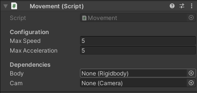
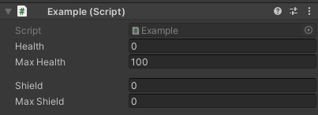
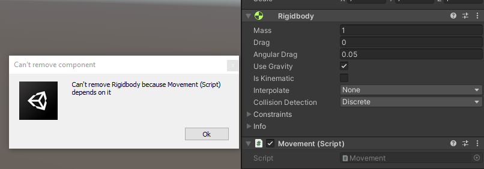




# Convenient Unity Attributes

Unity offers a range of convenient ways to manipulate and hack its inspector. Unfortunately, thanks to the size of Unity's documentation, these types of methods go unnoticed.

I won't attempt to iterate every useful attribute in Unity's library. I encourage you to explore Unity's documentation.

# Header

[Documentation](https://docs.unity3d.com/2022.1/Documentation/ScriptReference/HeaderAttribute.html)

This simple and effective attribute will display a header above the property to which it is applied.

```cs
public class Movement : MonoBehaviour
{
	[Header("Configuration")]
	public float MaxSpeed = 5f;
	public float MaxAcceleration = 5f;

	[Header("Dependencies")]
	public Rigidbody body;
	public Camera cam;
}
```



# Space

[Documentation](https://docs.unity3d.com/2022.1/Documentation/ScriptReference/SpaceAttribute.html)

The `Space` attribute adds user-defined pixel spacing between fields. I don't often reach for this attribute, but it can be handy in cases where a `Header` isn't appropriate. It helps designers scan through fields by creating a small visual break.

Unity's documentation illustrates a good use case (with some modifications).

```cs
public class Example : MonoBehaviour
{
    [SerializeField] private int health = 0;
    [SerializeField] private int maxHealth = 100;

    [Space(10)] // 10 pixels of spacing here.

    [SerializeField] private int shield = 0;
    [SerializeField] private int maxShield = 0;
}
```

A 10-pixel space is between `maxHealth` and `shield`.




# Tooltip

[Documentation](https://docs.unity3d.com/2022.1/Documentation/ScriptReference/TooltipAttribute.html)

Unsurprisingly, the `Tooltip` attribute creates a tooltip over a field when hovered. The use case for these types of in-engine documentation is nearly endless: providing context, usage hints, and so much more.

I won't use Unity's example because `Range` is better suited for that use case. We'll cover that attribute next.

```cs
public class Movement : MonoBehaviour
{
	[SerializeField]
	[Tooltip("Measured in meter/sec")]
	private float MaxSpeed = 5f;
}
```


Although in this particular case, I may suggest a custom attribute that appends "m/s" to the end of the field, a tooltip can provide this type of clarity and context.

# Range

[Documentation](https://docs.unity3d.com/2022.1/Documentation/ScriptReference/RangeAttribute.html)

We'll revisit Unity's `Tooltip` example with a different attribute: `Range`. 

```cs
public class Example : MonoBehaviour
{
    [Tooltip("Health value between 0 and 100.")]
    int health = 0;
}
```

This component wants to restrict `health` between 0 and 100. Rather than enforcing that restriction through code, it relies on the designer to abide by this restriction. Let's correct it using `Range`.

```cs
public class Example : MonoBehaviour
{
    [SerializeField, Range(0, 100)]
    private int health = 0;
}
```


The inspector is now enforcing the restriction and displaying it as a slider between the two values. I find this helps reason about the range better than a number field.


# SerializeField

[Documentation](https://docs.unity3d.com/2022.1/Documentation/ScriptReference/SerializeField.html)

Of all the attributes offered by Unity, this one sees the most use in my code. This attribute forces Unity's inspector to serialize and display the field in the inspector *regardless of accessibility*. This pattern is particularly effective for exposing values in the inspector while keeping them inaccessible to the codebase.

Consider this simple example.

```cs
public class Health:  MonoBehaviour
{
	public int Health = 5;
	public UnityEvent Damaged;	

	public void TakeDamage(int damage)
	{
		if (damage > 0)
		{
			Damaged?.Invoke();
			Health = Mathf.Max(Health - damage, 0);
		}
	}
}
```

Setting `Health` to `public` allows a designer to set the initial health and tweak it during gameplay. These types of considerations are great for playtesting and debugging. Unfortunately, *anything* can modify `Health` without calling `TakeDamage(int)` which, can introduce an undesirable side effect: the `Damaged` event won't fire.

It's possible to mitigate this issue by using a C# property.

```cs
public class Health :  MonoBehaviour
{
	private int health = 5;
	public int Health
	{
		get => health;
		set
		{
			if (value < health)
			{
				Damaged?.Invoke();
			}

			health = value;
		}
	}

	public UnityEvent Damaged;
}
```

It's now impossible to modify `Health` without firing `Damaged`. However, by default, Unity does **not** render C# properties in the inspector. A designer wanting to set the initial health or tweak the health value during playtesting will be unable. Let's try using `SerializeField` instead.

```cs
public class Health :  MonoBehaviour
{
	[SerializeField] private int health = 5;
	public UnityEvent Damaged;	

	public void TakeDamage(int damage)
	{
		if (damage > 0)
		{
			Damaged?.Invoke();
			health = Mathf.Max(health - damage, 0);
		}
	}
}
````

`health` will be editable in the inspector, but only `TakeDamage` will be accessible to code. It's also possible to combine the `property` and `SerializeField` approaches by exposing a private backing field to the inspector.

# HideInInspector

[Documentation](https://docs.unity3d.com/2022.1/Documentation/ScriptReference/HideInInspector.html)

This attribute acts as the reverse of `SerializeField`: this will hide a `public` field from the inspector. It is helpful for hiding complexities from a designer without rendering it inaccessible to the rest of the code.

Let's hide some component dependencies without making them inaccessible.

```cs
[RequireComponent(typeof(Rigidbody), typeof(CapsuleCollider))]
public class Movement : MonoBehaviour
{
	[HideInInspector] public Rigidbody Body;
	[HideInInspector] public CapsuleCollider Collider;

	private void Start()
	{
		Body = GetComponent<Rigidbody>();
		Collider = GetComponent<CapsuleCollider>();
	}
}
```


# RequireComponent

[Documentation](https://docs.unity3d.com/2022.1/Documentation/ScriptReference/RequireComponent.html)

This attribute doesn't neatly fit into this list, although I'm sure it's important enough to discuss. `RequireComponent` ensures that the specified component is attached to a GameObject. It's great for wrapping/enhancing built-in components or just assuring the existence of a dependency.

`RequireComponent` will automatically add any required components which are missing. It will also prevent removing them while using the inspector. It's added to the `MonoBehaviour` rather than a field.

```cs
[RequireComponent(typeof(Rigidbody))]
public class Movement : MonoBehaviour
{
	private Rigidbody body;

	private void Start()
	{
		body = GetComponent<Rigidbody>();
	}
}
```

Unity adds a `Rigidbody` if it doesn't already exist on the GameObject. Attempting to remove `Rigidbody` will cause an error.




